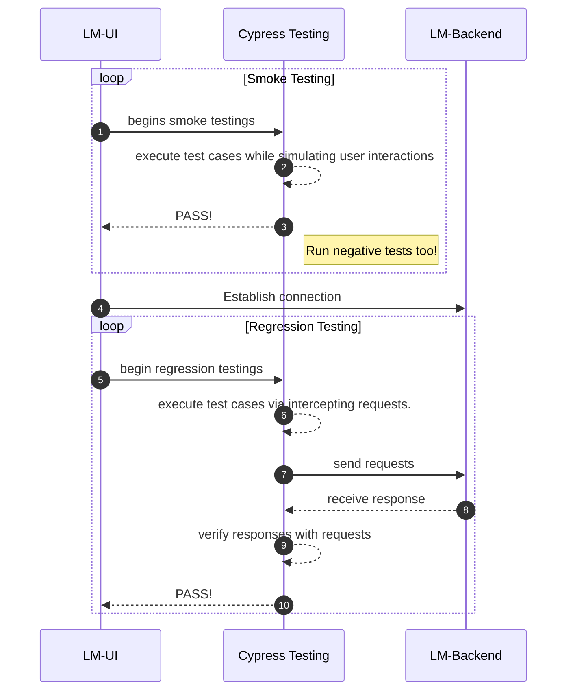
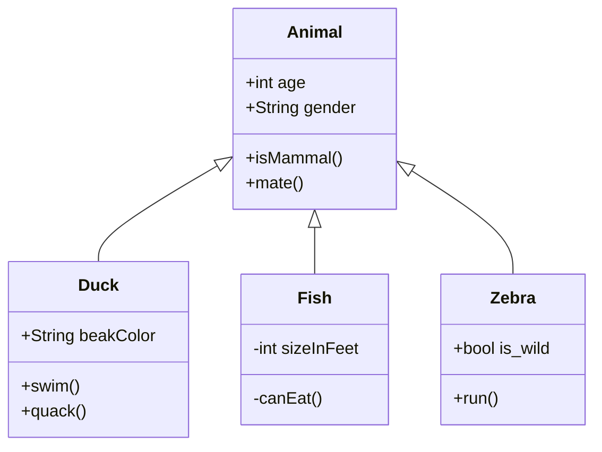
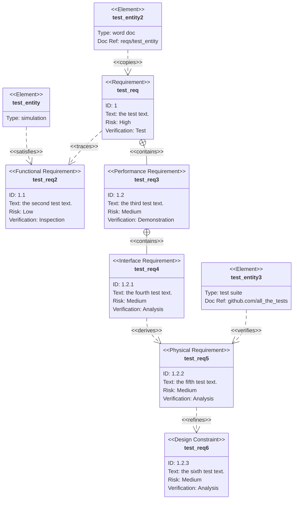

#### 2022/09/22 
# Tech Day : Mermaid Diagram

## 1. Purpose

##### Exploring markdown compatible diagram rendering tools that meets certain requirements.

## 2. Requirements

##### a. Must be able to implement in '.md' file.
##### b. Must be able to render various UML diagrams related to software testing and documentations.
##### c. Nice to have Github integration.
##### d. Nice to have low overhead.

## 3. Mermaid

##### There are two available diagram-rendering engines available for markdown documents, namely the PlantUML and Mermaid engines. However, PlantUML requires heavier resources (its own Java based rendering engine), and is not supported in the GitHub repository file viewers. Mermaid, on the other hand, is based on Javascript and requires less resources to work with, and have Github integration by default.

## 4. Use-cases for Testing

##### Mermaid's requirement diagram display software or testing requirements easily and satisfying elements in easy to understandable syntax.

