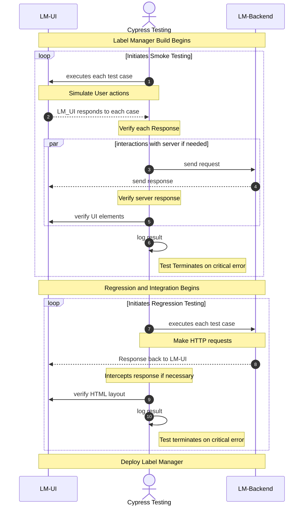
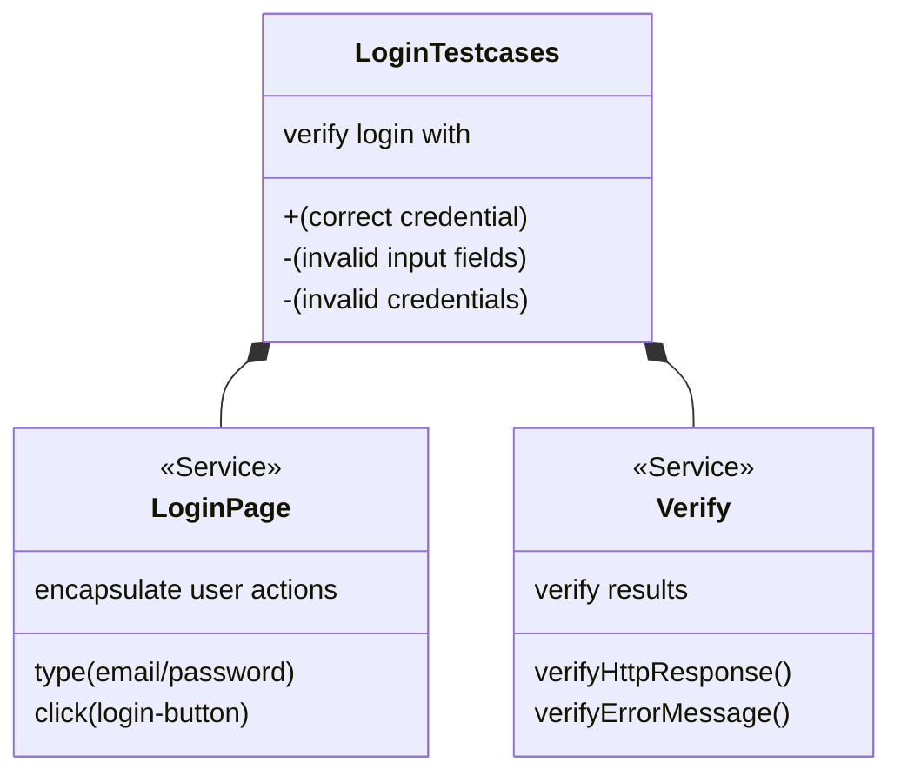
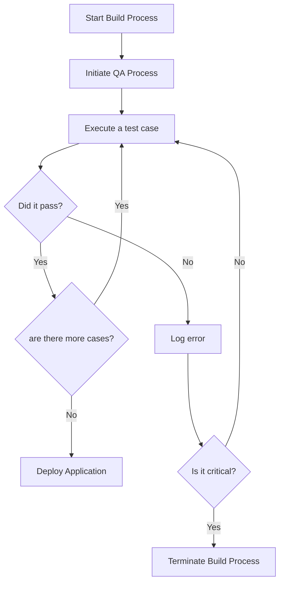

#### 2022/09/22 
# Tech Day : Mermaid Diagram

## 1. Purpose

#### Exploring markdown compatible diagram rendering tools that meets certain requirements.

## 2. Requirements

#### a. Must be able to implement in '.md' file.
#### b. Must be able to render various UML diagrams related to software testing and documentations.
#### c. Nice to have Github integration.
#### d. Nice to have low overhead.

## 3. Mermaid

#### There are two available diagram-rendering engines available for markdown documents, namely the PlantUML and Mermaid engines. However, PlantUML requires heavier resources (its own Java based rendering engine), and is not supported in the GitHub repository file viewers. Mermaid, on the other hand, is based on Javascript and requires less resources to work with, and have Github integration by default.

## 4. Use-cases for Testing

## * Login Page Test Sequences




## * Page Object Model Pattern Example

### Testcase Example: login.spec.js
```
describe("Login page tests", () => {
    ...
    // Positive Test
    it("User can login with a correct credential", () => {
    	onLoginPage.enterEmail(userLogin.email)
    	onLoginPage.enterPassword(userLogin.password)
    	onLoginPage.clickLoginButton(verifyResponse)
    })

    // Negative Test & Edge Cases
    it("User cannot login with an incorrect credential", () => {
        onLoginPage.enterEmail("userLogin@email.com")
        onLoginPage.enterPassword("userLogin.password")
        onLoginPage.clickLoginButton(expectError)
        verify.alertMessageDisplayed()
    })
    ...
}
```

### Page Object Model Example: login.page.ts
```
const selector = {
    emailField: '[placeholder="Email"]',
    passwordField: '[placeholder="Password"]',
    loginButton: '[data-test="feedback-button-save"]',
}

class LoginPage {
	enterEmail(email: string): void {
		email === ""
			? cy.get(selector.emailField).clear()
			: cy.get(selector.emailField).type(email)
	}

	enterPassword(password: string): void {
            ...
	}

	clickLoginButton(verifyOption: number = 0): void {
		if (verifyOption > 0) {
			cy.intercept(
				"POST",
				Cypress.env("API_HOST") + lmRoutes.signIn,
				(req) => {
					req.body = { ...req.body, failOnStatusCode: false }
					req.continue((res) => {
						expect(res.body.status).to.eq(200)

						if (verifyOption === verifyResponse) {
							expect(res.body.status).to.eq(200)
						} else {
							expect(res.body.status).not.eq(200)
						}
					})
				}
			)
		}
		cy.get(selector.loginButton).click()
	}
}
```

### Overview of above code structure using class diagram



## * Overall Build & Testing Flow Chart




